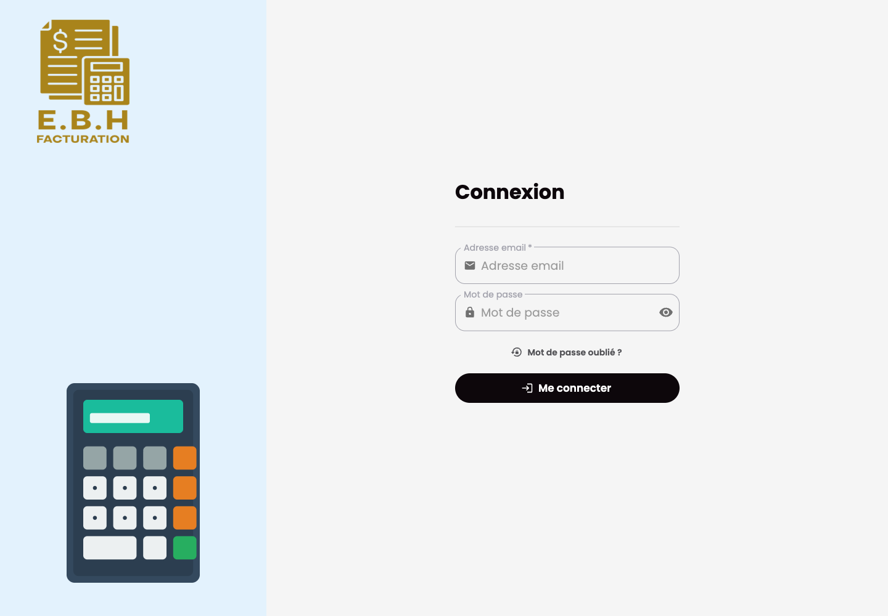

# Facturation Frontend

## Purpose

Facturation Frontend is the Next.js dashboard used to operate the billing system. It provides authenticated screens for companies, clients, articles, documents, payments, notifications, and reporting.

## Stack

- Next.js and React
- TypeScript
- NextAuth
- Redux Toolkit and redux-saga
- MUI, Sass, and chart components
- Formik and Zod
- Jest and Testing Library

## Features

- Authenticated dashboard navigation
- Client, company, and article management
- Quote, invoice, credit note, and delivery note screens
- Payment and objective tracking
- Notifications and profile settings
- Print-ready document workflows

## Setup

Provide local-only variables for the API, auth, and websocket endpoints. Use localhost values for local development and do not commit local configuration files.

```bash
bun install
bun run dev
```

The default frontend port is `localhost:3000`.

## Tests

```bash
bun x jest --runInBand --coverage=false
bun run lint
bun run build
```

## Screenshot


